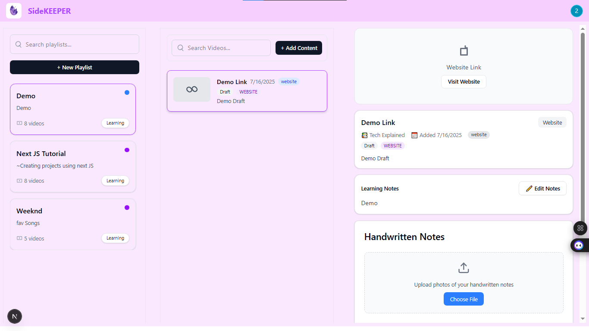
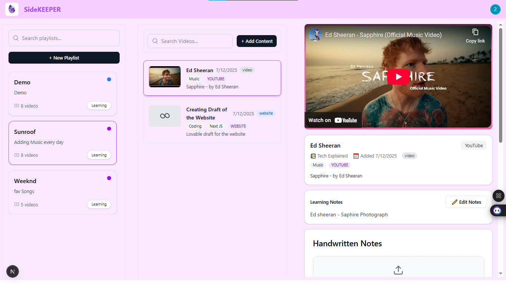
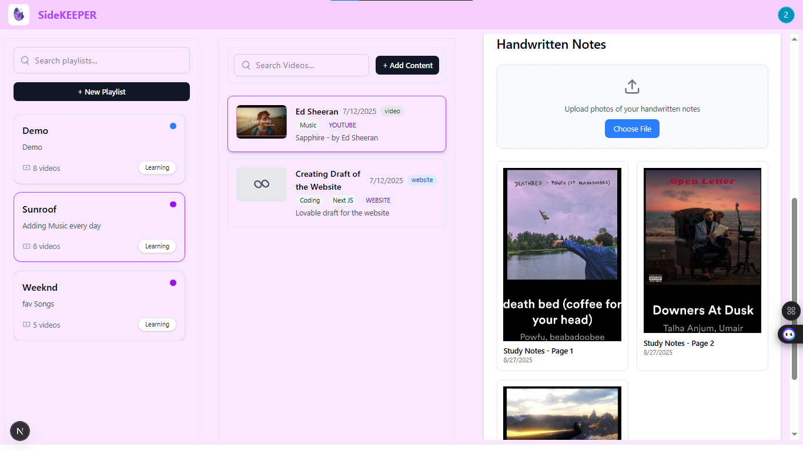

# 📂 SideKEEPER  

A **personalized content manager** built with **Next.js, Prisma, and Redux** where users can create playlists, add YouTube videos, websites, and handwritten notes, and organize learning resources in one place.  

---

## 🚀 Features  

- 🔐 **Authentication** – User registration and login with **NextAuth**  
- 🎶 **Playlists** – Create, manage, and search playlists  
- 📺 **Content Management** – Add YouTube videos, websites, or custom notes inside playlists  
- 📝 **Learning Notes** – Add/edit textual notes or upload handwritten notes  
- 🗄️ **Database Integration** – Postgres database with Prisma ORM (hosted on Neon)  
- ⚡ **Redux Store** – Manage and share state across components efficiently  
- 🎨 **Modern UI/UX** – Responsive design with loading screens for smooth experience  

---

## 🖼️ Screenshots

### 🔹 We can add links/website


### 🔹 we can add youtube videos 


### 🔹 we can add notes 


---

## 🛠 Tech Stack  

### Frontend  
- [Next.js 13+ (App Router)](https://nextjs.org/)  
- [React Redux Toolkit](https://redux-toolkit.js.org/)  
- [TailwindCSS](https://tailwindcss.com/)  

### Backend  
- [Next.js API Routes](https://nextjs.org/docs/app/building-your-application/routing)  
- [Prisma ORM](https://www.prisma.io/)  
- [Postgres (Neon)](https://neon.tech/)  
- [NextAuth.js](https://next-auth.js.org/) – Authentication  

---

## ⚙️ Installation & Setup  

### 1. Clone the repo  
```bash
git clone https://github.com/your-username/SideKEEPER.git
cd SideKEEPER
